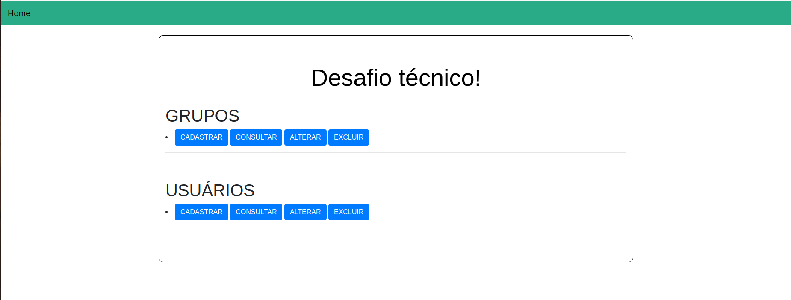
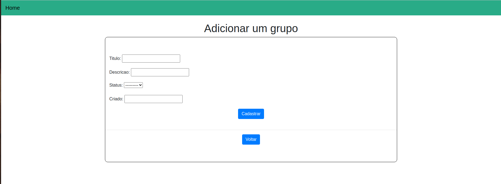
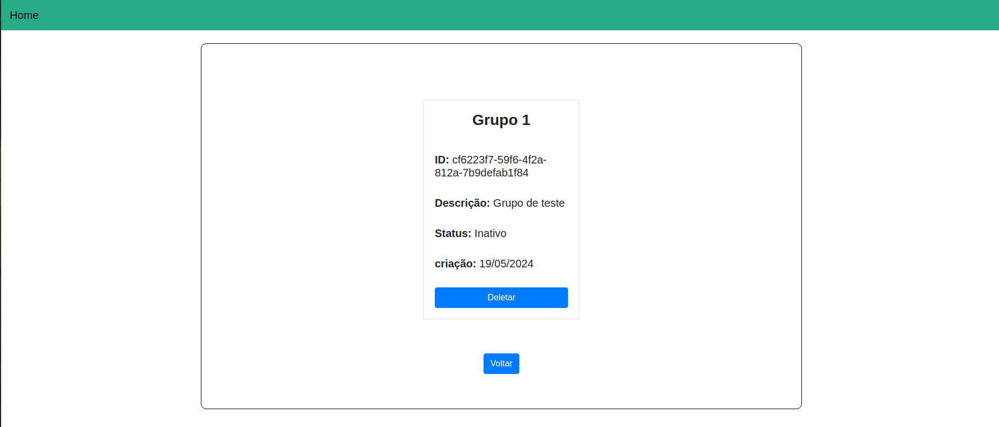
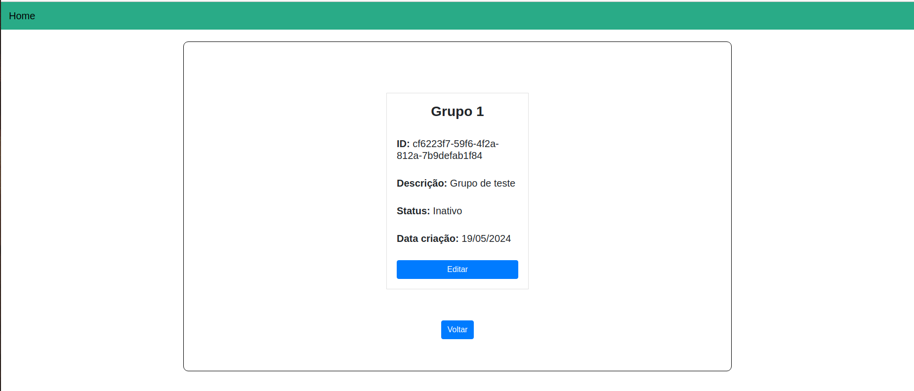
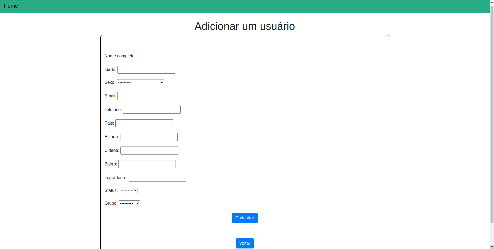

# Passo 1:
É necessário um usuário / senha Postgres ( Caso já possua o usuário esta etapa não é
necessária )
Para criar: sudo -u postgres createuser -P Projeto
Senha: admin

# Passo 2:
Criação do banco de dados

sudo -u postgres createdb 'nome-do-banco'

# Passo 3:
Navegue até o diretório em que se encontra o aquivo settings.py. O arquivo está no
seguinte caminho Desafio/API/settings.py
Neste arquivo é necessário informar o usuário e senha postgres e o nome da base de
dados.

Na linha 82 ‘DADOS_USUARIOS’ é o nome do banco de dados.
Na linha 83 ‘projeto’ é o nome do usuário.
Na linha 84 ‘admin’ é a senha

# Passo 4:
Para executar a API: No diretório ‘Desafio’ executar os seguintes comandos
Para ativar a maquina virtual python

source venv/bin/activate

Com a venv ativada: python3 manage.py migrate
pip install django-bootstrap-form
Para rodar o server: python3 manage.py runserve

### Sistema Final

